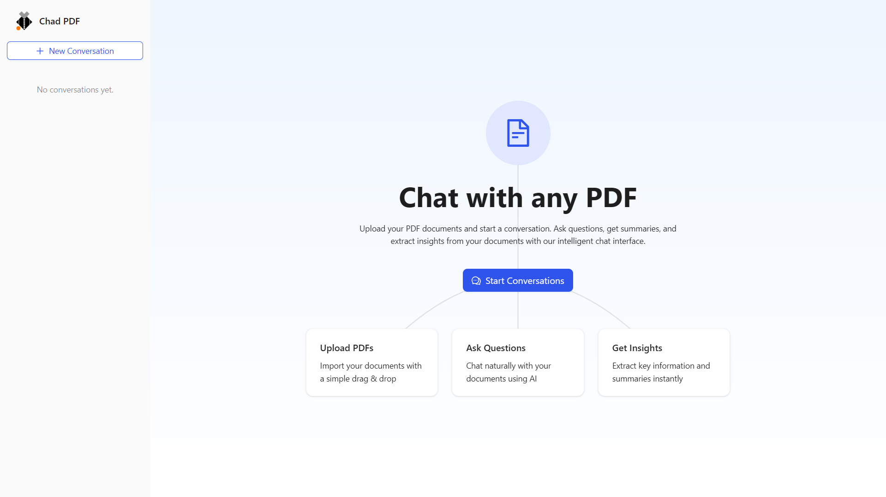
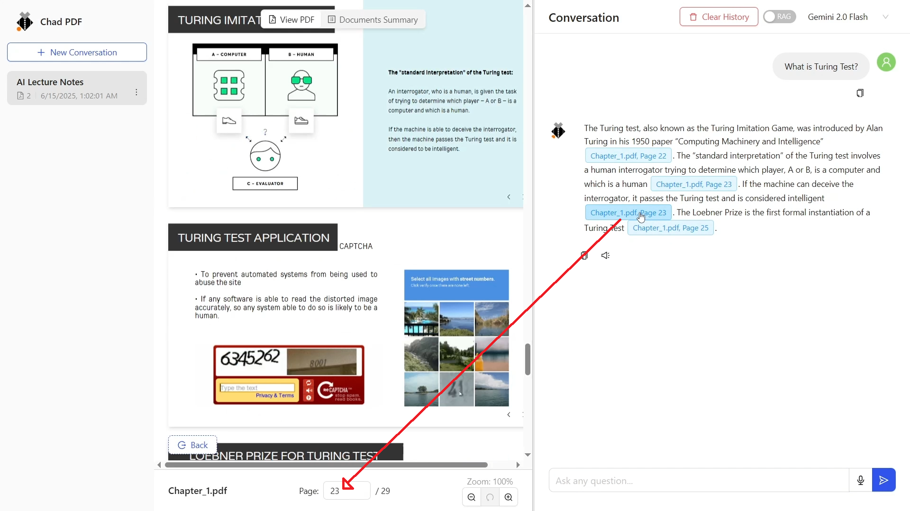
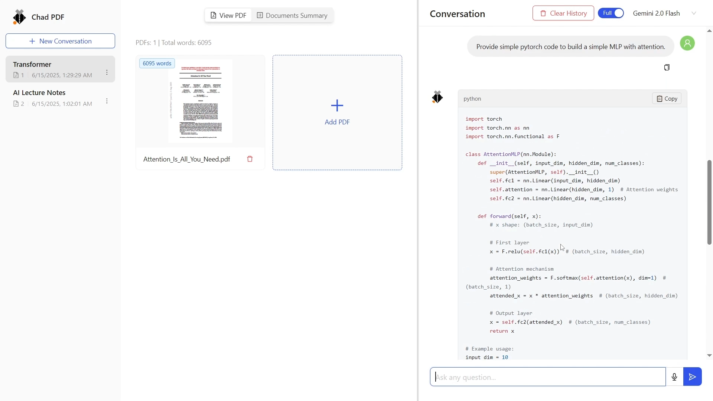

# 🏀 Chad PDF

Chad PDF is an interactive chat-based application that lets you have intelligent conversations with one or more PDF documents using powerful Language Models (LLMs). Whether you're studying, analyzing papers, or reviewing technical content, Chad PDF enables seamless Q&A.

---

## ✨ Features

### 🔍 Chat Modes

- **RAG Mode**: Retrieval-Augmented Generation across single or multiple PDFs.
- **Full Mode**: Full document ingestion for dense comprehension.

### 📘 Multi-PDF Navigation with Citation

- Each answer includes a clickable citation badge indicating the source PDF and page number.
- Reduces hallucination by grounding responses in verifiable document sources.

### 🧠 Conversation Memory

- Remembers your previous questions and context throughout the conversation.
- Supports meta-questions like: “What did I ask just now?” or “Summarize my past questions.”

### 📑 Conversation Management

- View, rename, and delete past conversations.
- Maintain multiple chat sessions across different documents.

### 🔁 Seamless LLM Switching

- Instantly switch between different LLMs (e.g., GPT-4 ↔ LLAMA) mid-conversation.

### 🧾 Markdown & Code-Friendly

- Renders markdown, and also math equations (LaTex).
- Renders code blocks with syntax highlighting.

### 🔊 Speech Interaction

- **Speech-to-Text**: Ask questions using your voice with real-time transcription.
- **Text-to-Speech**: Listen to AI-generated answers spoken aloud for accessibility or hands-free usage.

### 🧠 Summarization

- One click summarization of conversation document

### ⚙️ Input Optimization & Safeguards

- **Document Duplication Check**: Automatically disable same document to be uploaded multiple times to avoid redundancy.
- **Word Limit Control**: Enforces document word limits per conversation to manage LLM usage (context window).

---

## 🛠️ Tech Stack

### 🖥 Frontend

Built with **React + Vite + Tailwind + Ant Design**.

- `react-pdf`, `react-pdf-highlighter` for PDF rendering.
- `markdown-it`, `highlight.js` for markdown and code rendering.
- `framer-motion`, `redux`, `antd-style`, and more for smooth interaction.

### ⚙️ Backend

Built with **Python + Flask**.

- **LLM Integration**: OpenAI, HuggingFace via LangChain.
- **Vector Store**: ChromaDB for embeddings and similarity search.
- **PDF Parsing**: PyMuPDF, BeautifulSoup, Mistune.
- **Extras**: gTTS for optional voice features.
